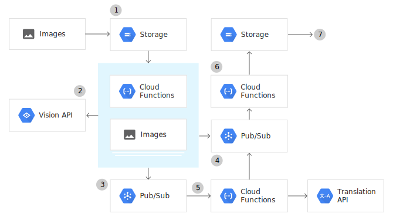

# OCR To Text Detection and Translation

## NOTE

- It would be fairly straight-forward to modify this code to use [Google Drive's push API](https://developers.google.com/drive/api/v3/push) rather than a storage bucket.

This app performs OCR text extraction, language detection, and translation using Google Cloud Platform's services. Namely:

- Google Cloud Storage: uploading image files and storing resulting translation text documents;
- Google Cloud Vision API: extract text from images;
- Google Cloud Translation API: detecting language and translating text;
- Google Cloud Pub/Sub: queue tasks and trigger appropriate Cloud Function to perform work

The flow of data involves the following steps:

1. An image with text from any language is uploaded to a specified Cloud Storage bucket;
2. Upon upload, a Cloud Function is triggered, which uses the Vision API to extract the text and detect the language from the uploaded image;
3. The extracted text is queued for translation by publishing a message to a specificed Pub/Sub topic. This application allows you to set several different target languages and separate queue is created for each target language.
4. If the target language matches the source language, the translation queue is skipped and text is sent to the result queue (another Pub/Sub topic) directly;
5. Another Cloud Function translates the text in the translation queue using the Translation API. The result is sent to the results queue;
6. Another Cloud Function saves the translated text from the results queue to a results Cloud Storage bucket;
7. All results are found as `txt` files for each translation;

The following is a visualization of the above steps.


## Setup

1. Select or Create a project at the [Project Selector Page](https://console.cloud.google.com/projectselector2/home/dashboard)
2. [Enable Cloud Functions, Cloud Build, Cloud Pub/Sub, Cloud Storage, Cloud Translation, and Cloud Vision APIs](https://cloud.google.com/service-usage/docs/enable-disable)
3. [Set up Node (if needed) and Cloud SDK](https://cloud.google.com/nodejs/docs/setup)
4. Update gcloud components: `gcloud components update`

## Prep

Note: ALL CAPS strings in commands below should be replaced with your own names.

1. Create a Cloud Storage Bucket to upload images to.
   `gsutil mb gs://YOUR_IMAGE_BUCKET_NAME`
2. Create a Cloud Storage bucket to save the resulting translations text to.
   `gsutil mb gs://YOUR_RESULT_BUCKET_NAME`
3. Create a Cloud Pub/Sub topic to publish translation requests to.
   `gcloud pubsub topics create YOUR_TRANSLATE_TOPIC_NAME`
4. Create a Cloud Pub/Sub topic to publish finished translation results to.
   `gcloud pubsub topics create YOUR_RESULT_TOPIC_NAME`

## Deploying Functions

1. To deploy the image processing function with a Cloud Storage trigger (uploading your image to Cloud Storage will trigger the image processing function), run the following command in the directory containing the index.js with the Cloud Functions:

```
gcloud functions deploy ocr-extract \
--runtime nodejs12 \
--trigger-bucket YOUR_IMAGE_BUCKET_NAME \
--entry-point processImage \
--set-env-vars "^:^GCP_PROJECT=YOUR_GCP_PROJECT_ID:TRANSLATE_TOPIC=YOUR_TRANSLATE_TOPIC_NAME:TO_LANG=es,en,fr,ja"
```

- `YOUR_IMAGE_BUCKET_NAME` is the name of the Cloud Storage bucket where you will upload your images;
- `YOUR_GCP_PROJECT_ID` is the Google Cloud Platform Project ID
- `YOUR_TRANSLATE_TOPIC_NAME` is the Google Pub/Sub topic you created to publish translation requests to;
- `es,en,fr,ja` are the selected languages to translate to. Change these to whatever you want.

2. To deploy the text translation function with a Cloud Pub/Sub trigger, run the following command in the directory containing the index.js with the Cloud Functions:

```
gcloud functions deploy ocr-translate \
--runtime nodejs12 \
--trigger-topic YOUR_TRANSLATE_TOPIC_NAME \
--entry-point translateText \
--set-env-vars "GCP_PROJECT=YOUR_GCP_PROJECT_ID,RESULT_TOPIC=YOUR_RESULT_TOPIC_NAME"
```

- `YOUR_TRANSLATE_TOPIC_NAME` is the Google Pub/Sub topic you created to publish translation requests to;
- `YOUR_GCP_PROJECT_ID` is the Google Cloud Platform Project ID
- `YOUR_RESULT_TOPIC_NAME` is the Google Pub/Sub topic you created to publish finished translation results to.

3. To deploy the function that saves results to Cloud Storage with a Cloud Pub/Sub trigger, run the following command in the directory containing the index.js with the Cloud Functions:

```
gcloud functions deploy ocr-save \
--runtime nodejs12 \
--trigger-topic YOUR_RESULT_TOPIC_NAME \
--entry-point saveResult \
--set-env-vars "RESULT_BUCKET=YOUR_RESULT_BUCKET_NAME"
```

- `YOUR_RESULT_TOPIC_NAME` is the Google Pub/Sub topic you created to publish finished translation results to.
- `YOUR_RESULT_BUCKET_NAME` is the Cloud Storage bucket to save the resulting translations text to.

## Uploading an Image

1. Upload the image
   `gsutil cp PATH_TO_IMAGE gs://YOUR_IMAGE_BUCKET_NAME`

- `PATH_TO_IMAGE` is the local path to an image file containing text in any language
- `YOUR_IMAGE_BUCKET_NAME` is the name of the bucket you set up to upload images to.

2. Watch the logs to check for success or errors
   `gcloud functions logs read --limit 100`

3. View saved translations in the Cloud Storage bucket that you set up to save resulting translations to. You can do by [viewing Storage Browser from Google Cloud Platform's Console](https://console.cloud.google.com/storage/browser)
